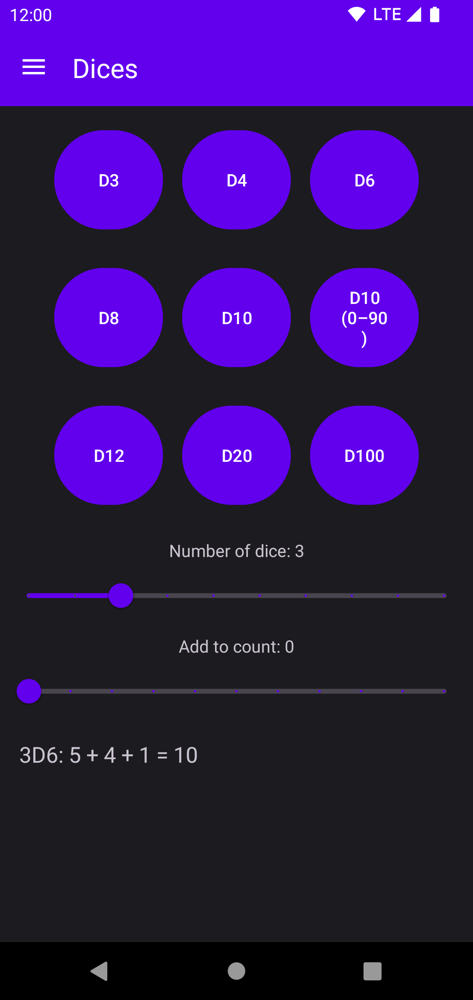
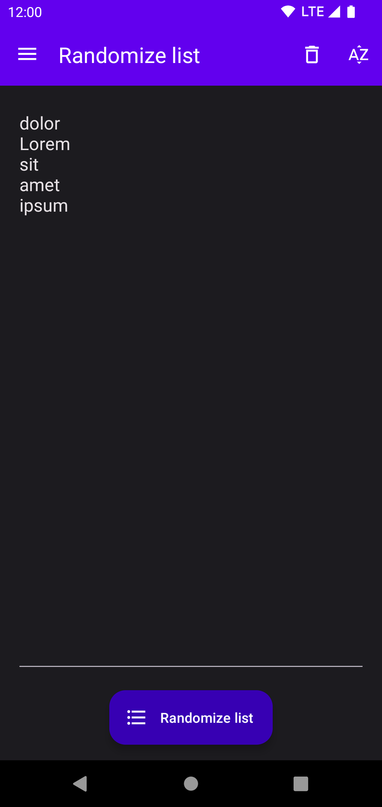
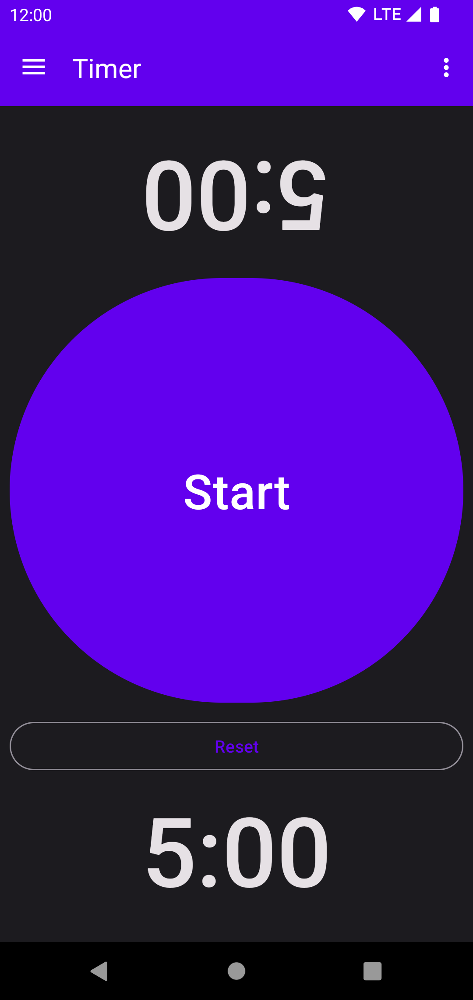
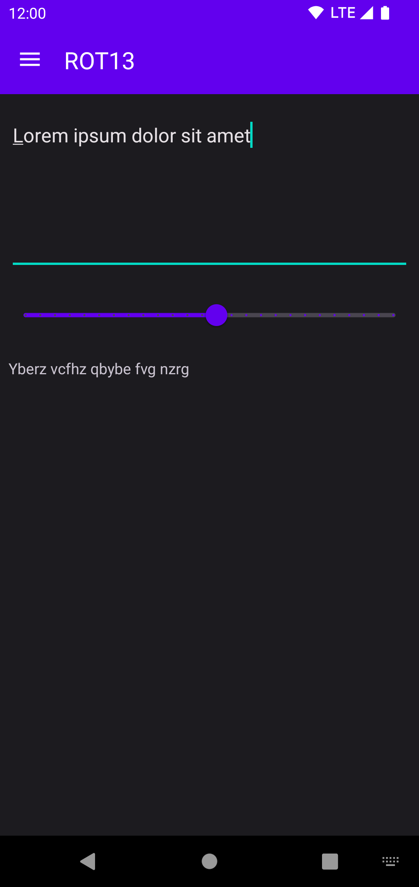

# Tabletop Tools

This Android app provides a few handy tools for tabletop games:
* Dice (D3, D4, D6, D8, D10, D12, D20, D100)
* [ROT13](https://en.wikipedia.org/wiki/ROT13)
* Number converter: Decimal <=> Binary <=> Hexadecimal
* Timer
* Buzzers for 1 - 4 players
* List that can be randomized

   

## Translations

App strings and the app store description can be translated via Crowdin: https://crowdin.com/project/tabletop-tools

Translations have to be approved before being merged into the app. To become a translator with approval rights or to request a new language, please [poke me on Crowdin](https://crowdin.com/profile/mueller-ma) or open an issue here on GitHub. 

## Credits

* Feature graphic by https://unsplash.com/@accrualbowtie
* Some icons by Google and https://materialdesignicons.com/
* Sound for the timer by https://soundbible.com/
* Sound for buzzer by https://mixkit.co
